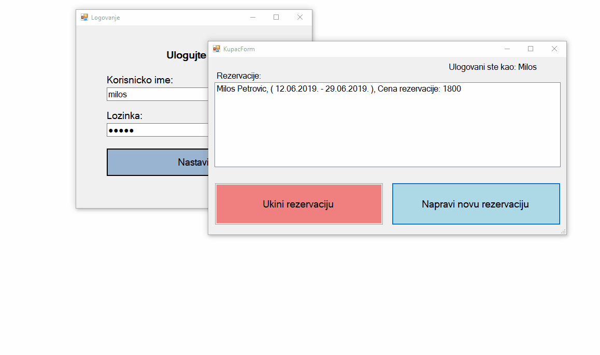

# Car rental
Desktop Windows Forms application for administrating car renting business. 
The app has Administrator and User roles.
Administrator:
* Can perform CRUD operations on users, reservations and available cars. 
* Can see statistics about renting in past 3 months. 
User:
* Can delete its reservations and make new ones. 

## Technologies:
* C# 
* Windows Forms 
* Data stored as serialised binary files. 

